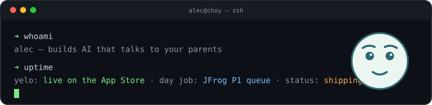

<div align="center">
  
  <br/><br/>
  
</div>

```console
➜ ls ~/ships
yelo/    AI voice companion for elderly, limited-English-speaking parents
         → live on the App Store — built for my own mom and dad
         → speaks the first sentence while the model is still thinking
         → 15 languages · native Swift iOS · Claude routing · Postgres RLS
         → yelofamily.com

➜ grep -r "day job" ~/jfrog
P1/P2 enterprise escalations — authentication (OIDC/SAML/OAuth) & supply-chain security
agentic case triage on Claude Code · SUP CLI — the team's default triage step

➜ cat /etc/fun-fact
drummed for Kanye West. not a typo.
```

<div align="center">


<picture>
  <source media="(prefers-color-scheme: dark)" srcset="https://raw.githubusercontent.com/Alecchoy/Alecchoy/output/github-snake-dark.svg"/>
  
</picture>

<sub>📫 <a href="mailto:alecchoy@gmail.com">alecchoy@gmail.com</a> · <a href="https://www.linkedin.com/in/alec-choy-387aab13b/">LinkedIn</a> · <a href="https://yelofamily.com">yelofamily.com</a></sub>

</div>
