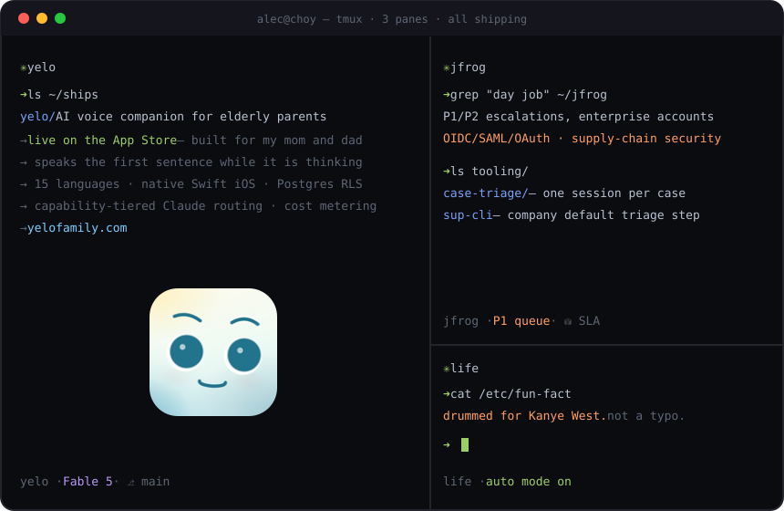

  
    

<picture>
  <source media="(prefers-color-scheme: dark)" srcset="https://raw.githubusercontent.com/Alecchoy/Alecchoy/output/github-snake-dark.svg"/>
  
</picture>

📫 <a href="mailto:alecchoy@gmail.com">alecchoy@gmail.com</a> · <a href="https://www.linkedin.com/in/alec-choy-387aab13b/">LinkedIn</a> · <a href="https://yelofamily.com">yelofamily.com</a>

